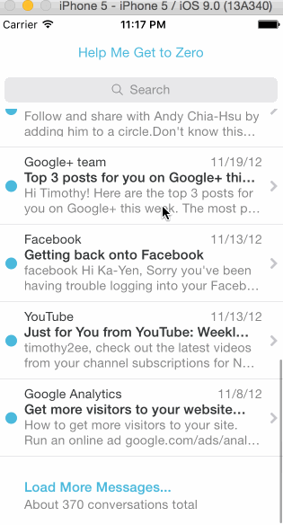
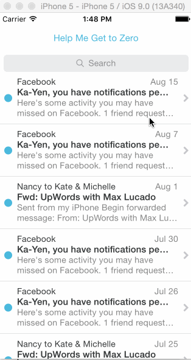

# MailboxExercise

Here's the user starting to reschedule the Aug. 15th email, then cancelling that and archiving it instead:

And here's the user starting to add the Aug. 15th email to a list, then cancelling that and deleting it instead:

However, when the user pans the message to the left and starts down the path of rescheduling, but then cancels that, then decides to pan the message to the left again, unfortunately I haven't figured out how to make the icons show up as they normally do:

